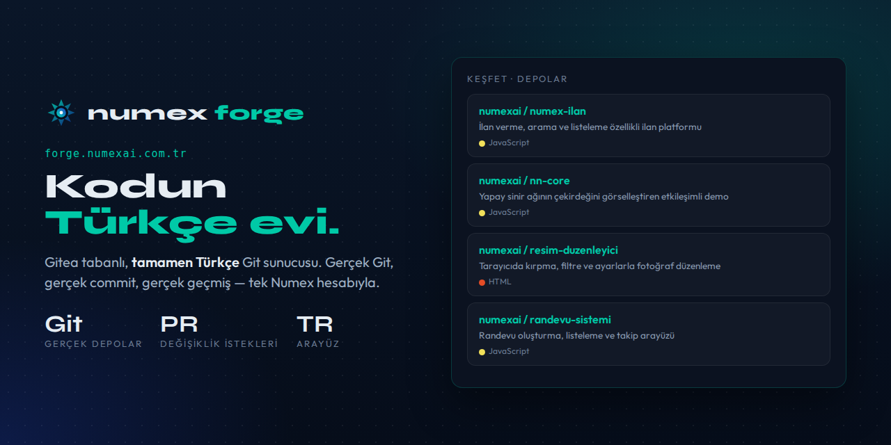

<div align="center">



# 🏗️ Numex Forge

### Kodun Türkçe evi.

**Gitea tabanlı, tamamen Türkçe Git sunucusu. Gerçek Git, gerçek commit, gerçek geçmiş — tek Numex hesabıyla.**

[](https://forge.numexai.com.tr)
[](https://forge.numexai.com.tr/explore/repos)
[](https://github.com/numexai/numex-hub)

</div>

---

Forge, Numex ekosisteminin **Git sunucusudur**. Codex'te ürettiğin projeler, Hub'da AI ile yaptığın
değişiklikler ve Market'teki açık kaynak uygulamaların kodu burada, gerçek Git depoları olarak durur.

## Özellikler

| Menü | Ne yapar? |
|---|---|
| **Konular** | Hata ve istek takibi (issues) |
| **Değişiklik İstekleri** | Pull request — kod incelemesi ve birleştirme |
| **Kilometre Taşları** | Sürüm ve hedef planlama |
| **Keşfet** | Herkese açık **depolar**, **kullanıcılar**, **organizasyonlar** — arama, filtre, sıralama |
| **Pano** | Son 12 ayın katkı ısı haritası, etkinlik akışı, depoların |
| **Depolar** | Kaynaklar · **Çatallar** · **Yansılar** (mirror); açık veya özel depo |
| **Organizasyonlar** | Ekip olarak depo sahipliği |

Arayüz **tamamen Türkçe**; Git istemcin (terminal, VS Code, Codex IDE) ile normal bir Git sunucusu gibi
çalışırsın: `git clone`, `git push`, dallar, etiketler.

## 🔓 `numexai` organizasyonundan açık depolar

Numex'in otonom ürettiği uygulamaların kaynak kodu Forge'da herkese açık:

| Depo | Açıklama | Dil |
|---|---|---|
| `numex-ilan` | İlan verme, arama ve listeleme özellikli ilan/pazar platformu arayüzü | JavaScript |
| `novax-saat` | Akıllı saat konseptini tanıtan etkileşimli, animasyonlu ürün sayfası | HTML |
| `nn-core` | Yapay sinir ağının çekirdeğini görselleştiren etkileşimli demo | JavaScript |
| `depo-yonetim` | Ürün, stok ve depo hareketlerini tek panelden yöneten arayüz | JavaScript |
| `envanter-dokuman` | Bir envanter API'sinin uç noktalarını anlatan interaktif belge | JavaScript |
| `randevu-sistemi` | Randevu oluşturma, listeleme ve takip arayüzü | JavaScript |
| `resim-duzenleyici` | Tarayıcıda kırpma, filtre ve ayarlarla fotoğraf düzenleme | HTML |
| `kelime-sayaci` | Metindeki kelime, karakter ve cümle sayısını anlık gösteren araç | HTML |
| `markdown-defter` | Markdown not defteri | HTML |

👉 [forge.numexai.com.tr/explore/repos](https://forge.numexai.com.tr/explore/repos)

## Başlarken

1. [numexai.com.tr](https://numexai.com.tr)'de Google veya GitHub ile giriş yap — Forge hesabın hazır.
2. [forge.numexai.com.tr](https://forge.numexai.com.tr) → **+** → yeni depo.
3. Klonla, kodla, gönder:
   ```bash
   git clone https://forge.numexai.com.tr/<kullanıcı>/<depo>.git
   ```
4. AI ile düzenlemek için depoyu [Numex Hub](https://github.com/numexai/numex-hub)'da aç.

## Hub ile birlikte

| 🏗️ **Forge** | 📦 **Hub** |
|---|---|
| Git sunucusu — depoların **evi** | Forge üzerinde çalışan **AI destekli arayüz** |
| Konular, PR'lar, kilometre taşları | "README'yi güncelle" de → öneri → Uygula → commit |
| "Numex'in GitHub'ı" | "Deposunu bilen yapay zekâ" |

---

<div align="center">

**Numex Ailesi** · [Numex AI](https://numexai.com.tr) · [Codex](https://github.com/numexai/numex-codex) · [Okul](https://github.com/numexai/numex-okul) · [Market](https://market.numexai.com.tr) · [Numexpedia](https://github.com/numexai/numex-pedia) · [Hub](https://github.com/numexai/numex-hub) · [Forge](https://github.com/numexai/numex-forge) · [API](https://github.com/numexai/numex-api) · [SDK](https://github.com/numexai/numex-sdk) · [Pusulam](https://github.com/mobilcep/pusulamx) · [PC Doktoru](https://github.com/mobilcep/pcdoktoru)

*İnsanı önce koyan Türk yapay zekâsı* 🇹🇷 · [Tüm ekosistem →](https://github.com/numexai/numex_nedir)

</div>
